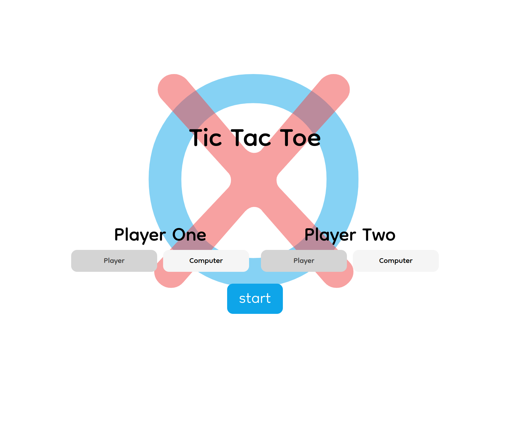
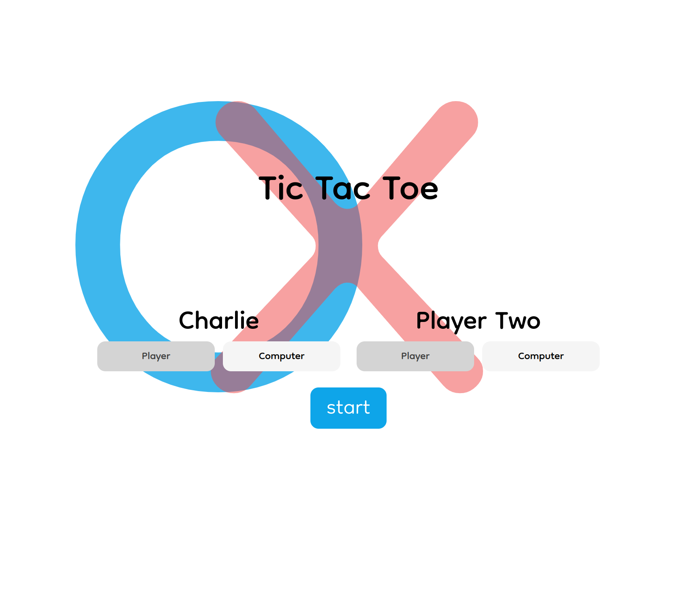
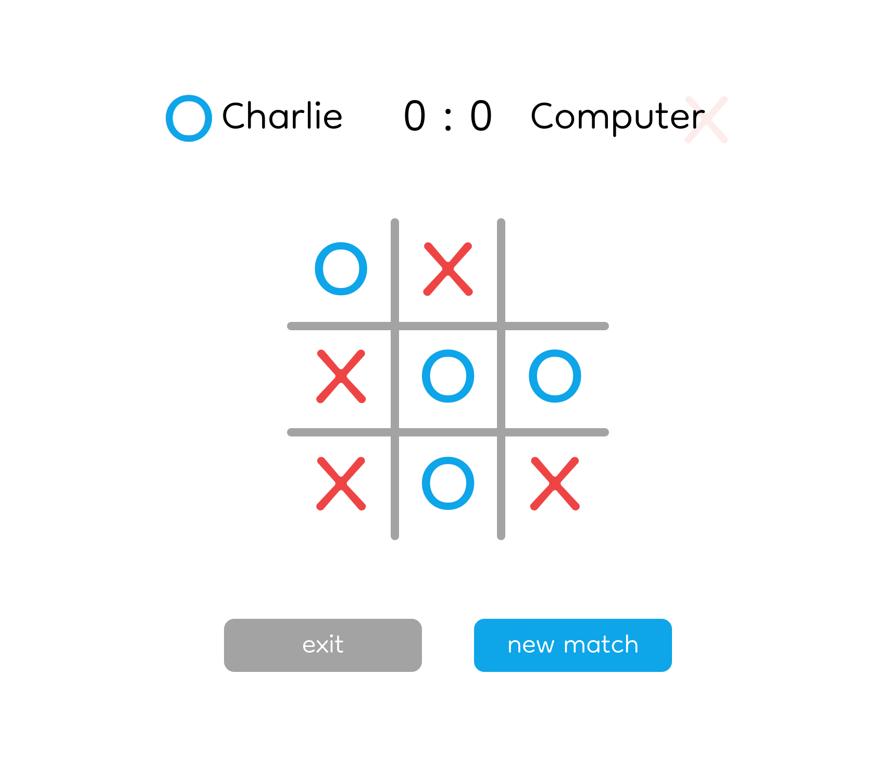
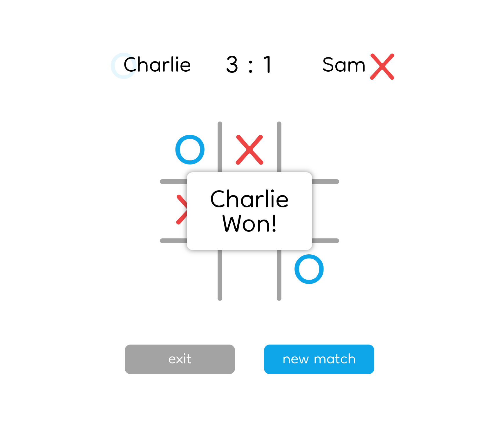

 

<h1 align="center">Tic-Tac-Toe</h1>

  

    A Tic-Tac-Toe web app that offers both
     
    Player vs Player and Player vs AI
     
    <a href="https://larrys-code.github.io/Tic-Tac-Toe/"><strong>See It Live »</strong></a>
     
     
    <a href="https://www.theodinproject.com/lessons/node-path-javascript-tic-tac-toe">See the lesson on The Odin Project</a>
  

<!-- TABLE OF CONTENTS -->

  
Table of Contents

  <ol>
    <li>
      <a href="#about-the-project">About The Project</a>
      <ul>
        <li><a href="#built-with">Built With</a></li>
      </ul>
    </li>
    <li><a href="#features">Features</a></li>
    <li><a href="#preview">Preview</a></li>
    <li><a href="#development-and-future-optimizations">Development and Future Optimizations</a></li>
    <li><a href="#acknowledgments">Acknowledgments</a></li>
  </ol>

<!-- ABOUT THE PROJECT -->
## About The Project

[![Product Name Screen Shot][product-screenshot]](https://larrys-code.github.io/Tic-Tac-Toe/)

This Project was made to practice **Factory Functions** and the JavaScript **Module Pattern** to build out the Tic-Tac-Toe game. Each module is seperated out with their own methods such that they are as loosely coupled as possible: the game was first built to work in the console before adding the function to display the game and interface with the user.  

It also features some basic CSS animation and minmax AI.

### Built With

* [![CSS][CSS-logo]][CSS-url]
* [![HTML5][HTML5-logo]][HTML5-url]
* [![Javascript][Javascript-logo]][Javascript-url]
* [![ESLint][ESLint-logo]][ESLint-url]
* [![Prettier][Prettier-logo]][Prettier-url]

(<a href="#readme-top">back to top</a>)

<!-- FEATURES -->
## Features

Players can change their names freely and choose to play versus another person or against a Computer that has 3 levels of difficulty.  

The scoreboard accurately keeps track of each player's score and displays which player's turn it is to move.

 

## Preview

| Start Screen | Changing Player Names |
| :-----: | :-----: |
|  |  |

| Player VS AI | Win Screen |
| :-----: | :-----: |
|  |  |

(<a href="#readme-top">back to top</a>)

<!-- OPTIMIZATIONS -->
## Development and Future Optimizations

- :green_circle: Players can set their names
- :green_circle: Uses Module Pattern to limit namespace pollution
- :large_orange_diamond: Implement AI player
    - :green_circle: Unbeatable minmax mode
    - :green_circle: Randomised moves within the range of winning/losing moves to improve replayablity
    - :large_orange_diamond: Easy difficulty does it's best to let the player win
    - :large_orange_diamond: Normal difficulty switches between losing and winning moves
    - :x: AI vs AI capability

The UI is fully built out but may encounter some bugs on other browsers.  

AI vs AI mode defaults to Player One vs AI. The code for the AI player wasn't designed with AI vs AI in mind so major adjustments would have to be made to accomodate it efficiently.  

Normal and Easy difficulty both work as intended but would need adjustments to be perfect. Normal difficulty is too strong and Easy difficulty can be forced into a draw (ideally Easy difficulty would **force** the player to win).

(<a href="#readme-top">back to top</a>)

<!-- ACKNOWLEDGMENTS -->
## Acknowledgments

* This project was completed as a part of [*"The Odin Project"*.](odin-url)
* The font used for the UI and pieces is [*"Dongle"* on fonts.google.com under the Open Font Licence](https://fonts.google.com/specimen/Dongle)

(<a href="#readme-top">back to top</a>)

[product-screenshot]: ./images/screenshot.png
[odin-url]: https://www.theodinproject.com/lessons/node-path-javascript-tic-tac-toe

[CSS-logo]: https://img.shields.io/badge/CSS%20-%231572B6.svg?style=for-the-badge&logo=css3&logoColor=white
[CSS-url]: https://www.w3.org/Style/CSS/#specs

[ESLint-logo]: https://img.shields.io/badge/ESLint-4B32C3?style=for-the-badge&logo=eslint&logoColor=white
[ESLint-url]: https://eslint.org/

[HTML5-logo]: https://img.shields.io/badge/HTML5%20-%23E34F26.svg?style=for-the-badge&logo=html5&logoColor=white
[HTML5-url]: https://html.spec.whatwg.org/

[Javascript-logo]: https://img.shields.io/static/v1?style=for-the-badge&message=JavaScript&color=222222&logo=JavaScript&logoColor=F7DF1E&label=
[Javascript-url]: https://www.ecma-international.org/publications-and-standards/standards/ecma-262/

[Prettier-logo]: https://img.shields.io/static/v1?style=for-the-badge&message=Prettier&color=222222&logo=Prettier&logoColor=F7B93E&label=
[Prettier-url]: https://prettier.io/